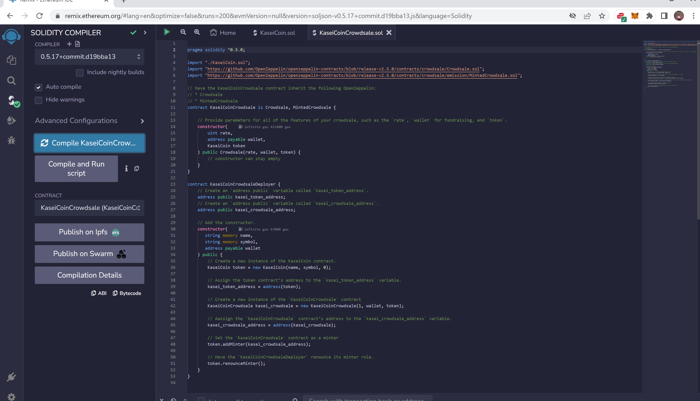
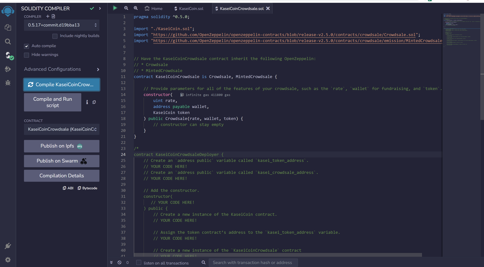
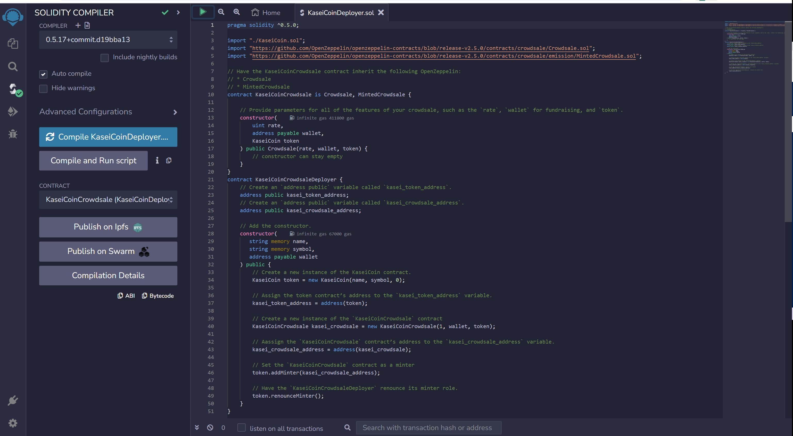
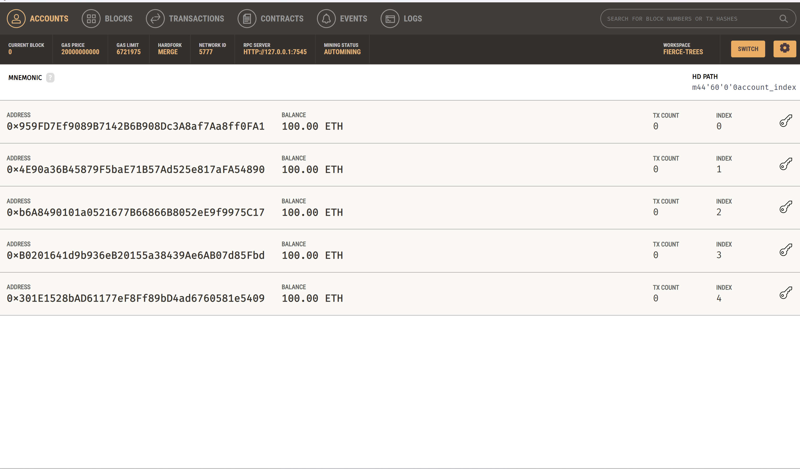
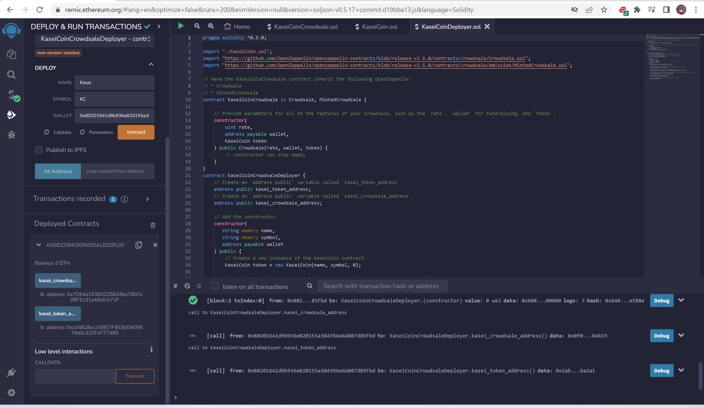
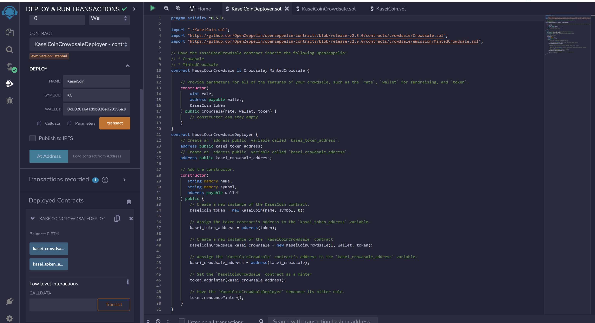
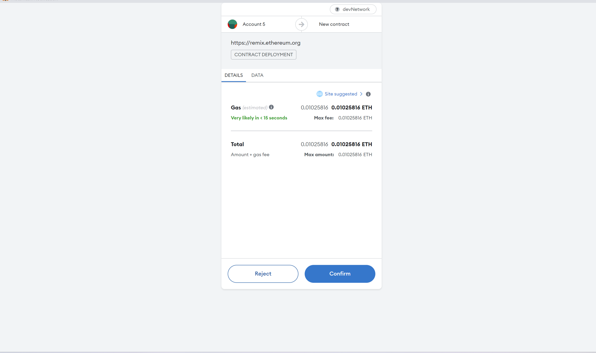
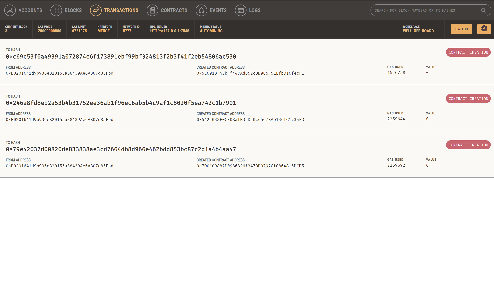

# Minting a fungible token with Solidity library: Martian Token Crowdsale

## KaseiCoin contract compiled

## KaseiCoin Crowdsale contract compiled

## KaseCoin Deployer contract compiled 

## Ganache accounts and Metamask integration

## Ganache confirmation contracts creation 

## Testing functionality after deployment of contracts 

